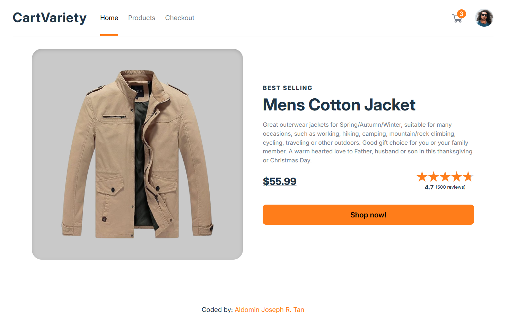
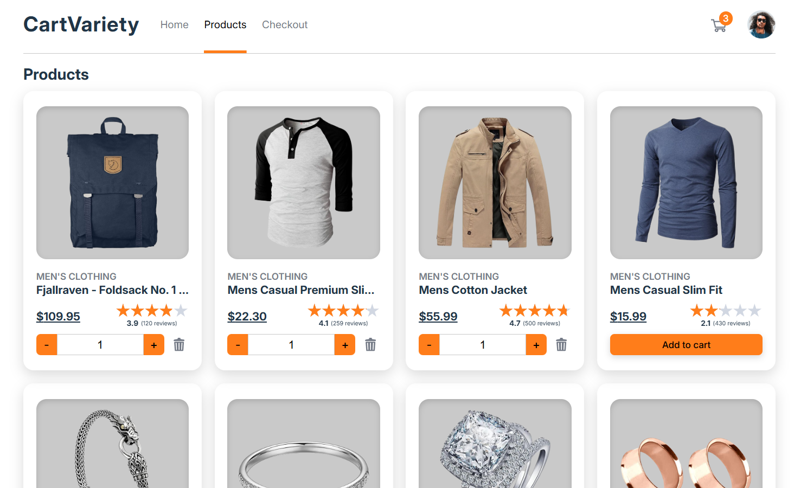
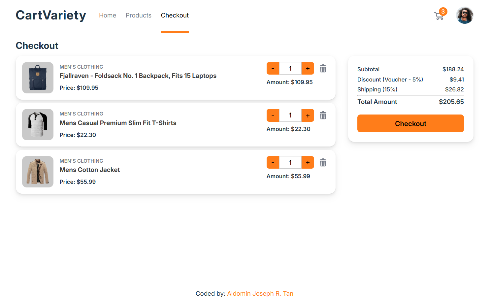

# CartVariety -- Shopping Cart React App

A modern **shopping cart web application** built with **React +
TypeScript** as part of The Odin Project React curriculum.\
This project focuses on learning component architecture, state
management, React Router, and testing while building a realistic
e-commerce interface.

The app allows users to browse products, add items to the cart, update
quantities, and proceed to checkout.

---

# Preview

## Home Page



## Products Page



## Checkout Page



---

# Features

- Product listing page
- Product quantity controls
- Add / remove items from cart
- Dynamic cart counter in the navbar
- Checkout page with cart summary
- Product ratings display
- Responsive product grid layout
- Navigation using React Router
- Component-based architecture
- Type safety using TypeScript
- Unit testing using Vitest and React Testing Library

---

# Technologies Used

- React
- TypeScript
- React Router
- Vitest
- React Testing Library
- CSS

---

# Concepts Practiced

This project was built while learning the following topics from The Odin
Project React curriculum:

### React Fundamentals

- React Components
- JSX
- Passing Data Between Components
- Rendering Techniques
- Keys in React

### State & Effects

- Introduction to State
- Managing and Updating State
- Handling Side Effects

### Class Components

- Class-based Components
- Component Lifecycle Methods

### React Testing

- Introduction to React Testing
- Mocking Components and Callbacks

### React Ecosystem

- Type Checking
- React Router
- Fetching Data
- Styling React Applications

---

# Installation

Clone the repository:

```bash
git clone https://github.com/yourusername/cartvariety.git
```

Go into the project folder:

```bash
cd cartvariety
```

Install dependencies:

```bash
npm install
```

Run the development server:

```bash
npm run dev
```

---

# Running Tests

```bash
npm run test
```

Tests are written using Vitest + React Testing Library to validate UI
behavior such as:

- Adding items to cart
- Updating item quantities
- Removing items
- Rendering correct cart totals

---

# Learning Outcome

This project helped me practice:

- Structuring a React application
- Managing state across components
- Using TypeScript with React
- Writing unit tests for UI behavior
- Building a realistic e-commerce UI
